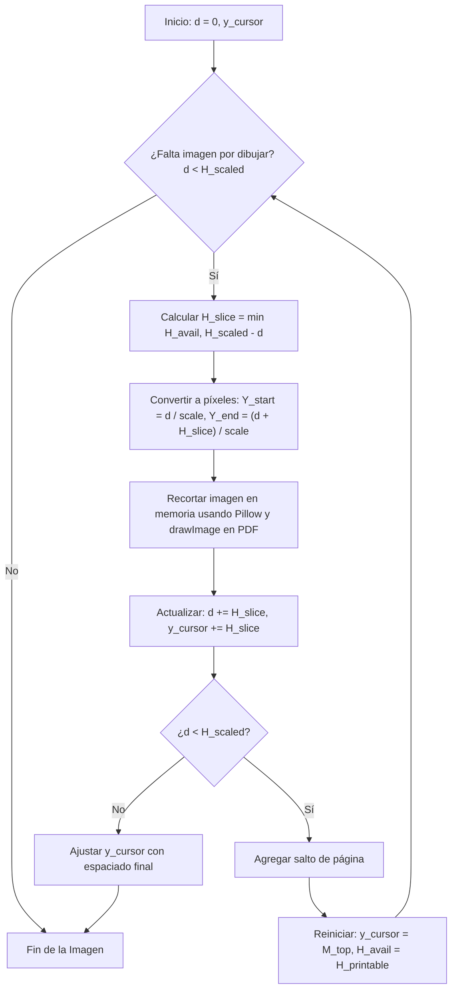

# cutImgPDF - Generador Automatizado de Informes PDF

`cutImgPDF` es una herramienta en Python diseñada para generar de forma automatizada informes en formato PDF con un diseño limpio y profesional. Resuelve el problema crítico de la inserción de capturas de pantalla extremadamente largas (como código fuente o registros de consola extensos), cortándolas horizontalmente de manera dinámica e inteligente para distribuirlas de forma armoniosa a lo largo de varias páginas del documento sin estiramientos, deformaciones ni pérdidas de información.

---

## Características Principales

1.  **Corte Horizontal Dinámico**: Evalúa el espacio vertical disponible en la página activa del PDF. Si una imagen excede este espacio, la divide en cortes horizontales en píxeles correspondientes, situando el primer recorte en el espacio disponible y los recortes subsiguientes en páginas consecutivas.
2.  **Maquetación en una o dos Columnas**: Admite imágenes simples que ocupan todo el ancho de la página, así como imágenes en paralelo (lado a lado), sincronizando su división de altura si superan los límites de página.
3.  **Prevención de Encabezados Huérfanos**: Garantiza que un subtítulo no quede solo al final de una página si no hay espacio mínimo para su contenido (umbral configurable).
4.  **Estética Premium y Doble Pasada**: Implementa un canvas personalizado que realiza dos pasadas al PDF para calcular dinámicamente el número total de páginas y pintar de forma automática encabezados elegantes y pies de página estilizados (`Página X de Y`).
5.  **Procesamiento Eficiente en Memoria**: Realiza todos los recortes directamente en memoria RAM utilizando Pillow y pasándolos a ReportLab, de modo que no se generan archivos temporales basura en el disco duro.

---

## Lógica Matemática y Algoritmo de Corte

La lógica matemática del motor de diseño se basa en la equivalencia de proporciones entre la resolución de la imagen original en píxeles y las dimensiones de impresión física en puntos de PDF ($1 \text{ pulgada} = 72 \text{ puntos}$).

### 1. Sistema de Coordenadas
Definimos las dimensiones de la página seleccionada como $W_{\text{page}}$ y $H_{\text{page}}$ en puntos de PDF (por ejemplo, para Letter es $612 \times 792$ pt).
El área de impresión válida queda delimitada por los márgenes ($M_{\text{left}}, M_{\text{right}}, M_{\text{top}}, M_{\text{bottom}}$):
*   $W_{\text{printable}} = W_{\text{page}} - M_{\text{left}} - M_{\text{right}}$
*   $H_{\text{printable}} = H_{\text{page}} - M_{\text{top}} - M_{\text{bottom}}$

La posición vertical se gestiona mediante un cursor $y_{\text{cursor}}$ que se incrementa de arriba hacia abajo:
*   Al inicio de una página: $y_{\text{cursor}} = M_{\text{top}}$.
*   El límite máximo permitido para contenido es: $y_{\text{limit}} = H_{\text{page}} - M_{\text{bottom}}$.
*   El espacio vertical remanente es:
    $$H_{\text{avail}} = y_{\text{limit}} - y_{\text{cursor}}$$

Dado que ReportLab dibuja por defecto utilizando el origen en la esquina inferior izquierda, el punto inferior de dibujo ($Y_{\text{canvas}}$) para un elemento de altura $h$ se calcula como:
$$Y_{\text{canvas}} = H_{\text{page}} - y_{\text{cursor}} - h$$

### 2. Escalado Proporcional
Para asegurar que una imagen quepa exactamente en el ancho disponible de su columna ($W_{\text{col}}$) sin sufrir deformación, calculamos un factor de escala uniforme $scale$:
$$scale = \frac{W_{\text{col}}}{W_{\text{img\_px}}}$$
Donde:
*   $W_{\text{img\_px}}$ es el ancho en píxeles de la imagen original.
*   $W_{\text{col}} = W_{\text{printable}}$ (para imágenes individuales).
*   $W_{\text{col}} = \frac{W_{\text{printable}} - spacing_{\text{col}}}{2}$ (para imágenes duales lado a lado).

La altura total de la imagen escalada a puntos de impresión es:
$$H_{\text{scaled}} = H_{\text{img\_px}} \times scale$$

### 3. Algoritmo de Corte e Inserción Iterativa
Si $H_{\text{scaled}} > H_{\text{avail}}$, la imagen requiere ser fragmentada horizontalmente.



Para mantener la alineación cuando se insertan **dos imágenes lado a lado**, la altura de bloque máxima es $H_{\text{block}} = \max(H_{\text{scaled1}}, H_{\text{scaled2}})$. Las dos imágenes se dividen de forma síncrona en el mismo porcentaje de altura para que se muestren simétricas y alineadas en el PDF final.

---

## Estructura del Código

La herramienta está construida de manera modular y limpia en el directorio `src/`:

*   [`src/pdf_generator.py`](file:///c:/Users/ngmh2/OneDrive/Documentos/cutImgPDF/src/pdf_generator.py): Contiene la clase `NumberedCanvas` (responsable de la cabecera y el pie de página dinámico) y la clase `PDFReportGenerator` (responsable de la lógica matemática de maquetación y corte).
*   [`src/cli.py`](file:///c:/Users/ngmh2/OneDrive/Documentos/cutImgPDF/src/cli.py): Interfaz de línea de comandos que se encarga del parseo de argumentos y de cargar y validar la configuración JSON.

---

## Instalación y Requisitos

La herramienta requiere **Python 3.8+** y dos dependencias de procesamiento de PDFs e imágenes:
*   `reportlab` (para la estructuración y renderizado del PDF)
*   `pillow` (para la manipulación y recorte de píxeles)

1.  Crea e instala el entorno virtual en la raíz del proyecto:
    ```bash
    # Crear entorno virtual
    python -m venv venv

    # Activar entorno virtual
    # En Windows (PowerShell):
    .\venv\Scripts\Activate.ps1
    # En macOS/Linux:
    source venv/bin/activate

    # Instalar dependencias
    pip install -r requirements.txt
    ```

---

## Uso de la Herramienta

La herramienta se ejecuta desde la terminal pasando un archivo JSON que describe el contenido y estructura del informe.

### Comando de Ejecución
```bash
python src/cli.py --config example_config.json --output reporte_final.pdf --page-size LETTER
```

### Argumentos Soportados
*   `-c`, `--config` (Requerido): Ruta al archivo de configuración JSON.
*   `-o`, `--output` (Opcional): Ruta del PDF final. Por defecto: `reporte_generado.pdf`.
*   `-s`, `--page-size` (Opcional): Tamaño de página (`LETTER` o `A4`). Por defecto: `LETTER`.
*   `--min-split-height` (Opcional): Altura mínima en puntos requerida para hacer un corte. Si el espacio en la página es menor a este umbral, el corte se empuja a la siguiente página. Por defecto: `100`.
*   `--margin-left`, `--margin-right`, `--margin-top`, `--margin-bottom` (Opcional): Márgenes del PDF en puntos. Por defecto: `54.0` (0.75 pulgadas).

---

## Formato del Archivo de Configuración JSON

El archivo JSON debe contener un arreglo de objetos ordenados secuencialmente. Cada objeto representa un componente del informe.

### Tipos de Componentes
1.  **Título (`title`)**: Inserta un título destacado con tipografía premium y una línea decorativa inferior.
    ```json
    { "type": "title", "text": "Título del Informe" }
    ```
2.  **Subtítulo (`subtitle`)**: Inserta un encabezado de sección con prevención de orfandad de página.
    ```json
    { "type": "subtitle", "text": "1. Análisis de Funcionalidades" }
    ```
3.  **Texto de Cuerpo (`text`)**: Inserta párrafos explicativos con soporte para formato en negrita o cursiva mediante etiquetas HTML básicas.
    ```json
    { "type": "text", "text": "Este es un párrafo de ejemplo con texto en <b>negrita</b>." }
    ```
4.  **Imagen Simple (`image`)**: Carga una imagen, la escala proporcionalmente y la divide horizontalmente en múltiples páginas si supera la altura restante.
    ```json
    { "type": "image", "path": "ruta/a/la/imagen.png" }
    ```
5.  **Doble Imagen (`double_images`)**: Coloca dos imágenes lado a lado alineadas perfectamente, dividiéndolas de forma sincronizada si exceden el límite de página.
    ```json
    { "type": "double_images", "path1": "imagen_izq.png", "path2": "imagen_der.png" }
    ```
